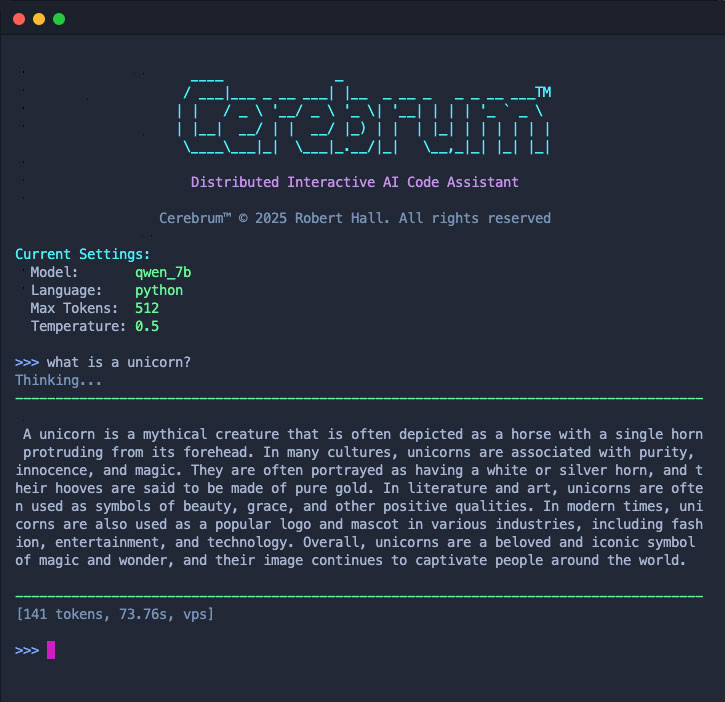

# Cerebrum™ - Distributed Interactive AI Code Assistant

### Token-streaming code generation optimized for Raspberry Pi CM4 + cloud architecture

> Real-time AI code completion and refactoring running on a Clockwork Pi uConsole **Raspberry Pi CM4**, powered by VPS inference and intelligent context management.

<p align="center">
  
</p>

## What Makes Cerebrum Different

**Streaming-First Design**
> Token-by-token Server-Sent Events (SSE) for real-time code generation feedback

**Intelligent Context Management**
> Smart chunking reduces 8KB+ prompts by up to 62% while preserving refactoring instructions

**Edge Orchestration**
> Raspberry Pi CM4 handles routing, chunking, and request coordination with <100ms overhead

**Production-Grade Resilience**
> Circuit breakers, connection pooling, load shedding, and request correlation IDs throughout

**Language-Aware Model Routing**
> Automatic selection between Qwen-7B (Python/JS) and CodeLLaMA-7B (Rust/C/C++) per request

**Lightweight CLI Interface**
> Streaming REPL with multiline support, command history, and live token display

## Architecture
```
┌─────────────────────────────────────────────────────────┐
│  Raspberry Pi CM4 (Orchestrator)                        │
│  ┌───────────────────────────────────────────────────┐  │
│  │  FastAPI Server (Port 7000)                       │  │
│  │  • Instruction extraction & prompt assembly       │  │
│  │  • Smart chunking (1000 char blocks, 150 overlap) │  │
│  │  • Deduplication (hash-based fingerprinting)      │  │
│  │  • Load shedding (max 2 concurrent requests)      │  │
│  │  • Request tracking (UUID correlation)            │  │
│  └───────────────────────────────────────────────────┘  │
└───────────────────┬─────────────────────────────────────┘
                    │
                    │ HTTP/Tailscale (Streaming SSE)
                    │ Chunked prompts → Token stream
                    │
┌───────────────────▼─────────────────────────────────────┐
│  VPS Inference Backend (Port 9000)                      │
│  ┌───────────────────────────────────────────────────┐  │
│  │  llama.cpp Runtime                                │  │
│  │  • Model: qwen-7b-q4.gguf / codellama-7b-q4.gguf  │  │
│  │  • Inference: ~1.6 tok/s (CPU, single-threaded)   │  │
│  │  • Connection pool: Persistent httpx client       │  │
│  │  • Circuit breaker: 10s cooldown on failures      │  │
│  └───────────────────────────────────────────────────┘  │
└─────────────────────────────────────────────────────────┘
```
Data Flow:

1. User prompt → CM4 extracts instructions
2. CM4 chunks large code (if >1500 chars)
3. CM4 deduplicates repeated patterns
4. CM4 selects top 3 relevant chunks
5. CM4 assembles instruction-first prompt
6. VPS streams tokens back via SSE
7. CM4 proxies stream to client in real-time

---
## Real-World Performance and Capabilities
**Intelligent Prompt Handling**
- Instruction extraction (e.g. refactor / rewrite / TODO directives)
- Instruction-first prompt assembly for base code models
- Automatic fallback to raw prompts when transformation is not beneficial

**Smart Chunking & Deduplication**
- Chunks only when prompts exceed safe thresholds
- Deduplicates overlapping code blocks
- Uses task-aware ranking (instruction-driven, not naive similarity)
- Skips chunking entirely when reduction is insignificant

**Streaming Inference:**
- Small prompts (<100 chars): ~17s for 33 tokens (1.9 tok/s)
- Large prompts (8KB): ~182s for 129 tokens (0.7 tok/s) after 62% chunking reduction
- CM4 overhead: <100ms for chunking + routing

**Context Management:**
- Input: 8,344 chars (repeated synchronous code)
- After chunking: 3,167 chars (62% reduction)
- Result: Actual async/await refactored code (not TODO lists!)

**Resource-Aware Design:**
- Max concurrent: 2 requests (load shedding)
- Circuit breaker: 10s cooldown after VPS failures
- Request timeout: Configurable per endpoint
- Connection pooling: Persistent HTTP client (no repeated initialization)

**Interactive REPL + API**
- Bash-based interactive shell for fast iteration
- Full FastAPI surface for automation and tooling

---

## 🚀 Quick Start
**Prerequisites**
- Raspberry Pi CM4 (4GB RAM 0GB eMMC Lite)
- VPS with 4GB+ RAM (8GB+ for multiple large models running simultainiously)
- Python 3.11+
- Deployment Models Pre-installed (See below)

### 1. Start VPS Backend
```
# On VPS
cd ~/cerebrum-backend
./start_vps.sh

# Verify health
curl http://localhost:9000/health
```
### 2. Start CM4 Orchestrator
```
# On Raspberry Pi
cd /opt/cerebrum-pi
./start.sh

# Verify health
curl http://localhost:7000/health
```
### 3. Launch Streaming REPL
```
cd /opt/cerebrum-pi/scripts
./cerebrum_repl.sh
```
**REPL Commands:**
```
>>> :help              Show commands
>>> :model qwen_7b     Switch model
>>> :lang python       Set language
>>> :multi             Toggle multiline mode
>>> def fibonacci(n):  Generate code!
```
---

## Deployment Model

Cerebrum is composed of **two independently deployed systems**

### CM4 Orchestrator (Raspberry Pi)

**The CM4 never runs large models. It decides *what* to send, *how much* to send,** 
**and *how* to stream results back efficiently.**
- Runs continuously on the Pi
- Handles all user interaction
- Enforces safety and performance constraints

### 📘 Deployment Guide:  
[`cerebrum-pi/README.md`](./cerebrum-pi/README.md)

---

### VPS Inference Backend

**Runs heavy LLM inference using `llama.cpp` with strict resource controls**
- The backend supports multiple GGUF models via llama.cpp-compatible runtimes
- Models are selected dynamically at request time
- Exposes inference and streaming endpoints
- Tuned for CPU/GPU efficiency

### 📘 Deployment Guide:  
[`cerebrum-backend/README.md`](./cerebrum-backend/README.md)

---

**Note:**  
The root of this repository is **not directly executable**.  
All runtime instructions live in the component-specific READMEs above.

## 📂 Project Structure
```
Cerebrum/
├── cerebrum-pi/              # CM4 Orchestrator
│   ├── cerebrum/
│   │   ├── api/
│   │   │   ├── routes/
│   │   │   │   ├── inference.py      # Streaming endpoints
│   │   │   │   ├── _chunking_helper.py  # Smart chunking logic
│   │   │   │   └── health.py         # Health checks
│   │   │   └── middleware/
│   │   │       ├── request_id.py     # UUID correlation
│   │   │       ├── log_context.py    # Request logging
│   │   │       └── load_shed.py      # Concurrency limiting
│   │   ├── core/
│   │   │   └── vps_client.py         # Connection pooling, circuit breaker
│   │   └── retrieval/
│   │       ├── chunker.py            # Text chunking
│   │       ├── ranker.py             # Relevance ranking + dedup
│   │       ├── assembler.py          # Prompt assembly
│   │       └── instruction_parser.py # Instruction extraction
│   ├── scripts/
│   │   └── cerebrum_repl.sh          # Streaming CLI
│   └── start.sh
│
└── cerebrum-backend/         # VPS Inference
    ├── vps_server/
    │   └── main.py                   # llama.cpp streaming
    └── start_vps.sh
```

## Development Workflow

1. Edit on macOS (VS Code + VS Code Insider)
2. Sync to CM4 (`rsync`)
3. Sync to VPS (`rsync`)
4. Test locally via REPL or API
5. Iterate without redeploying the full system

This workflow enables rapid iteration despite a split architecture.

## Documentation

See `docs/` directory for detailed information:
- [Architecture](./docs/architecture/Architecture.md)
- [API Reference](./docs/api/API.md)
- [Optimization](./docs/optimization/PERFORMANCE.md)

## License

Cerebrum™ © 2025 Robert Hall. All rights reserved.

This project is licensed under the [MIT License](./LICENSE).

---

## Acknowledgments

Built with:
- [FastAPI](https://fastapi.tiangolo.com/) - High-performance async web framework
- [llama.cpp](https://github.com/ggerganov/llama.cpp) - Efficient LLM inference
- [httpx](https://www.python-httpx.org/) - Modern HTTP client with connection pooling
- [Qwen](https://github.com/QwenLM/Qwen) - Alibaba's excellent code model

Inspired by the challenge of running production AI on edge devices.

---

**Questions? Issues? PRs welcome!**