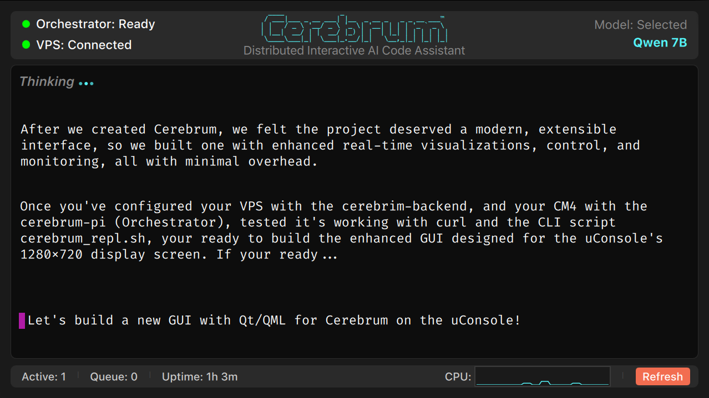

# CerebrumGUI

Native Qt/QML desktop-grade edge device interface for Cerebrum distributed AI orchestration system.

<p align="center">
  
</p>

---

## Overview

**CerebrumGUI** provides real-time monitoring and interaction in an intuitive, informative, and  easy-to-read display - in conjunction with the Cerebrum Orchestrator running on Raspberry Pi CM4. Cerebrum's new fully functional ***Graphical User Interface*** includes: token-by-token streaming, live system metrics, CPU monitoring, color-coded health indicators, and more...

**24-bit True Color Rendering with:**

- **Real-Time SSE Streaming** - Token-by-token code generation display
- **Health Indicators** - Orchestrator and VPS connection status with hysteresis (smoothing)
- **Model Mapping** - detects and displays currently selected (active) models on VPS
- **Toolbar with Live Metrics** - Active requests, queue depth, system uptime
- **CPU Monitoring** - 60-sample rolling graph (2-minute window)
- **Refresh Button** - clears the viewport and reinitializes the orchestrator connection with animation to confirm
- **Caret Anchor Highlight** - auto-hiding caret right where you'd expect it, we added a highlight anyway
- **Dark Theme** - high contrast terminal interface with antialiasing - optimized for extended use
- **Keyboard Shortcuts** - Fast navigation and control

> Note: the caret highlight is intentionally fixed as a visual default location anchor rather than a moving element, thereby reducing visual jitter during streaming output.

---
## Platform
- **OS:** Debian 12 

- **Device:** Designed primarily for use with the ClockworkPi uConsole (Raspberry Pi CM4), can also be used with any similar edge, *cyberdeck*, or other conceptual device with compatible 1280x720 display

## Prerequisites

### Required
- **Qt 6.9.2+**
- **CMake 3.21.1+**
- **Ninja** build system
- **C++17** compatible compiler (GCC 10+)
- **[Fira Code](https://github.com/tonsky/FiraCode)** ttf font (recommended)

### Debian/Raspberry Pi CM4
```bash
sudo apt update
sudo apt install \
  qt6-base-dev \
  qt6-declarative-dev \
  cmake \
  ninja-build \
  g++ \
  fonts-firacode
```

**Installed packages provide:**
- **qt6-base-dev** (6.9.2+) - Qt Core, GUI, Network modules
- **qt6-declarative-dev** (6.9.2+) - QML and Qt Quick runtime
- **cmake** (3.21.1+) - Build system
- **ninja-build** - Fast parallel builds
- **g++** - C++17 compiler
- **fonts-firacode** - Monospace font

**Note:** Qt 6.9.2 includes all necessary runtime libraries and QML modules as dependencies.

---

## Building from Source

### 1. Clone Repository
```bash
cd ~/Cerebrum/cerebrum-pi/CerebrumGUI
```

### 2. Create Build Directory
```bash
mkdir build-validate
cd build-validate
```

### 3. Configure with CMake
```bash
cmake -GNinja \
  -DCMAKE_BUILD_TYPE=Release \
  -DFETCHCONTENT_UPDATES_DISCONNECTED=ON \
  ..
```

### 4. Build
```bash
ninja
```

**Build Output:** `./CerebrumGUIApp` (executable)

---

## Configuration

### Environment Variables

CerebrumGUI connects to the Cerebrum orchestrator via configurable endpoints:

| Variable | Default | Description |
|----------|---------|-------------|
| `CEREBRUM_HOST` | `localhost` | Orchestrator hostname/IP |
| `CEREBRUM_PORT` | `7000` | Orchestrator port |

**Example - Local Orchestrator:**
```bash
./CerebrumGUIApp
```

**Example - Remote Orchestrator (via Tailscale):**
```bash
export CEREBRUM_HOST=100.00.00.00
export CEREBRUM_PORT=7000
./CerebrumGUIApp
```

### API Endpoints

CerebrumGUI expects the following orchestrator endpoints:

| Endpoint | Method | Purpose |
|----------|--------|---------|
| `/health` | GET | System metrics and health status |
| `/v1/complete/stream` | POST | SSE streaming inference |
| `/v1/models` | GET | Available models (optional) |

See: [Cerebrum Backend API](../../cerebrum-backend#api-endpoints) for endpoint specifications.

---

## Usage

### Interface Layout

**Top Bar:**
- **Left:** Health indicators (Orchestrator, VPS)
- **Center:** Animated (on startup + refresh) ASCII Art (Cerebrum™ logo)
- **Right:** Selected/Active model display

**Chat Area:**
- **Output:** Automatic scrolling text display with on-demand (auto-hide) scrollbar
- **Input:** Multi-line prompt entry (press Enter to submit)
- **Generation Indicator:** "Thinking" Animation appears at request, hides when generation complete

**Footer:**
- **Metrics:** Active requests, Queue depth, Uptime
- **CPU Graph:** Real-time CM4 CPU usage (60-sample rolling window)
- **Refresh Button:** Reconnect to orchestrator

### Sending Prompts

1. Type your prompt in the input field
2. Press **Enter** to submit
3. Watch token-by-token streaming output
4. Generation statistics appear after completion

**Example Output:**
```
>>> Write a Python function to calculate fibonacci

def fibonacci(n):
    if n <= 1:
        return n
    return fibonacci(n-1) + fibonacci(n-2)

[42 tokens, 2.3s]
```

### Health Status Indicators

**Orchestrator:**

🟢 **Ready** - Connected and responsive

🟠 **Waiting** - 1-2 failed health checks

🔴 **Offline** - 3+ consecutive failures

**VPS:**

🟢 **Connected** - Backend inference available

🟠 **Connecting** - Intermittent connection

🔴 **Disconnected** - No backend available

---

## Keyboard Shortcuts

| Shortcut | Action |
|----------|--------|
| `Enter` | Send prompt |
| `Ctrl+R` | Refresh connection |
| `Esc` | Quit application |

---

## Architecture Notes

### Active Model Reporting

**With support for:**
- Multiple cached models
- LRU-style "active model" detection
- Future multi-model UI selectable expansion

CerebrumGUI displays the currently active model reported by the orchestrator via `/health` endpoint's `active_model` field. Model selection UI is present - but intentionally non-functional (to avoid thrashing the server). The active model is determined by the most recently loaded or used model within the VPS inference engine.
 Manual model selection requires manual VPS configuration.

**To change models:**
1. SSH into VPS

2. Stop the VPS backend: 
```bashp
pkill -f "uvicorn vps_server.main"
```
3. Update model configuration in `vps_server/main.py`(see [model-configuration](../../cerebrum-backend#model-paths-important))

4. Restart the backend 
```bash
cd ~/cerebrum-backend
source venv/bin/activate
uvicorn vps_server.main:app --host 127.0.0.1 --port 9000
```

5. Click **Refresh** in GUI to reconnect

> **Note:** Dynamic model switching may be enabled in an upcoming project, with Cerebrum the foundation...

### Connection Management

- **Health Polling:** Every 2 seconds (paused during active generation)
- **Reconnection:** Automatic via Refresh button or Ctrl+R
- **Timeout Handling:** Graceful degradation with visual status indicators

### SSE Streaming

CerebrumGUI implements robust Server-Sent Events parsing:
- Cross-platform line ending normalization (`\r\n` → `\n`)
- Event boundary detection (`\n\n`)
- Buffer flushing on stream close
- Handles both complete and partial events

---

## Development

### Project Structure
```
CerebrumGUI/
├── CMakeLists.txt           # Build configuration
├── src/
│   ├── main.cpp             # Qt initialization
│   ├── CerebrumClient.h     # API client interface
│   └── CerebrumClient.cpp   # SSE parsing, networking
├── content/
│   ├── App.qml              # Window wrapper
│   └── Screen01.qml         # Main UI (1280x720)
├── imports/
│   └── CerebrumGUI/
│       ├── Constants.qml    # Window size, theme
│       └── qmldir           # Module definition
├── main.qml                 # Entry point
└── qtquickcontrols2.conf    # Qt theme (Universal Dark)
```

### Qt Design Studio

Project includes `.qmlproject` for Qt Design Studio 4.1+ workflow:
- Visual QML editing
- Live preview
- Component library integration

**Note:** C++ types (CerebrumClient) not visible in Designer - use QML preview for layout only.

### Building with Debug Symbols
```bash
cmake -GNinja -DCMAKE_BUILD_TYPE=Debug ..
ninja
```

Debug build enables extensive SSE parsing logs via `qDebug()`.

**Notes on our Development Workflow**
 + Initial GUI prototyping was performed on macOS using Qt Design Studio 4.1.1
+ Final development, validation, and target deployment use Qt 6.9.2+

---

## Troubleshooting

**"Orchestrator: Offline" on startup:**
- Verify orchestrator is running: `systemctl status cerebrum-backend`
- Check firewall: `sudo ufw allow 7000/tcp`
- Test endpoint: `curl http://localhost:7000/health`

**No token streaming:**
- Check VPS inference server is running
- Verify `/v1/complete/stream` endpoint exists
- Review terminal output for SSE parsing errors

**Font rendering issues:**
- Install Fira Code: `sudo apt install fonts-firacode`
- Fallback to system monospace if unavailable

---

## License

Cerebrum™ © 2025 Robert Hall. All rights reserved.

This project is licensed under the [MIT License](./LICENSE).

## Third-Party Licenses

This project uses Qt, which is licensed under LGPL v3.  
See [Qt's Open Source Licensing](https://www.qt.io/licensing/open-source-lgpl-obligations) for details.

---

## Related Documentation

- [Cerebrum](../../README.md) - Cerebrum Project
- [Qt Documentation](https://doc.qt.io/qt-6/) - Qt framework reference
- [QML Reference](https://doc.qt.io/qt-6/qmlapplications.html) - QML language guide

---

## Contributing

CerebrumGUI is part of the Cerebrum distributed AI project. Contributions, bug reports, and feature requests are welcome.

See: [Cerebrum](../../README.md) main for contribution guidelines.

## Acknowledgments

Built with:

- [Qt](https://www.qt.io/) - GUI framework with Qt Design Studio for native GUI development
- [Debian Project](https://www.debian.org/) - Bookworm base system foundations  
- [Raspberry Pi](https://www.raspberrypi.com/) is a trademark of Raspberry Pi Ltd
- [ClockworkPi](https://www.clockworkpi.com/) - uConsole Kit RPI-CM4

## Support

**Found a bug?** Open an issue in the main [Cerebrum](https://github.com/artcore-c/Cerebrum/issues) repository

**Have questions?** See [Troubleshooting](#troubleshooting) or review [Related Documentation](#related-documentation)

---

🕯 Built with passion for real-world edge computing, AI systems, and related communities.